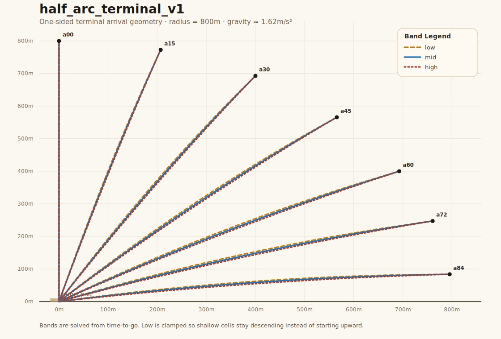
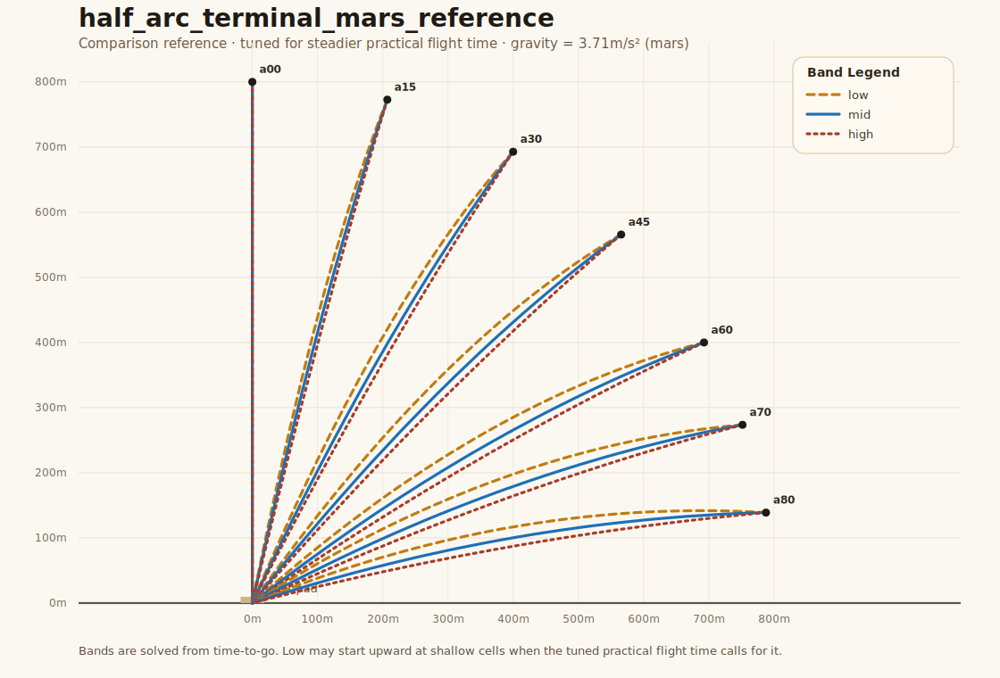
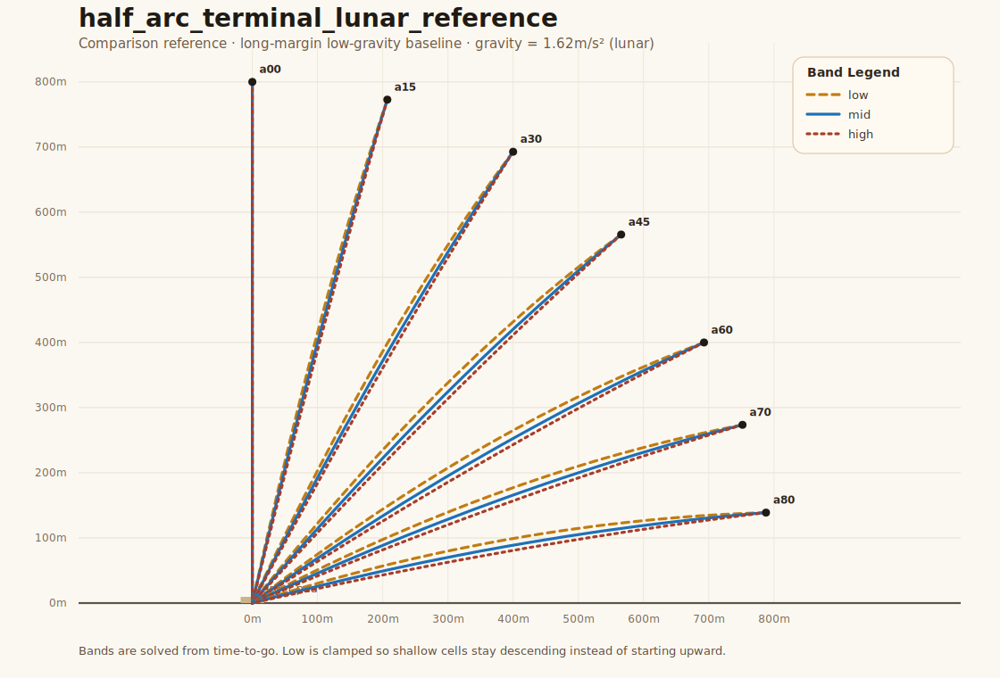

# Terminal Suite Design

This document is the maintained design reference for the terminal-guidance
evaluation suite.

It is intentionally not an implementation checklist. The point is to keep the
suite model, coverage philosophy, and selector structure explicit as the lab
evolves, because scenario and eval design directly shape controller
development.

## Purpose

The terminal suite is the main controller workbench in `pd-lab`.

It should answer:

- can a controller land reliably across the intended terminal arrival space?
- where inside that space does it become fragile?
- how much spread exists between seeds within the same physical case?
- how does a new controller compare against the current baseline on the exact
  same resolved runs?

This is why suite design is a first-class artifact, not just a byproduct of
implementation.

## Design Principles

### Physical case first, controller lane separate

The physical test case and the controller under test should not be the same
selector axis.

The suite should separate:

- physical-case selector
- controller lane

That way the same resolved case can be run through:

- `baseline`
- `current`
- future controller lanes

without inventing different scenario identities for each controller.

### Matrix for arrival space, hierarchy for scenario class

Terminal guidance is not a pure tree and not a pure flat list.

Use hierarchy for the class of case:

- `mission`
- `arrival_family`
- `condition_set`
- `vehicle_variant`

Use a dense matrix for the arrival space inside that class:

- `arc_point`
- `velocity_band`

Use `seed` only for small local variation inside a matrix cell.

### Seed variation must stay small

Inter-seed variation is itself a core metric.

That means seed jitter should be strong enough to perturb the control sequence,
but weak enough that the controller is still solving the same physical case.

If a perturbation changes the qualitative reaction too much, it does not belong
in the seed policy. It belongs in:

- a different `condition_set`
- a different `vehicle_variant`
- or a different arrival matrix cell

## Selector Model

The intended resolved selector shape is:

- `mission=terminal_guidance`
- `arrival_family=half_arc_terminal_v1`
- `condition_set=clean`
- `vehicle_variant=nominal`
- `arc_point=a30`
- `velocity_band=mid`
- `seed=0042`
- `controller=baseline_v1`

Interpretation:

- hierarchy axes tell you what class of terminal case this is
- matrix axes tell you where inside the arrival space the case sits
- seed tells you which small local variation was applied
- controller tells you which lane ran that case

## Arrival Family

The first real arrival family should be:

- `half_arc_terminal_v1`

This replaces the current provisional seeded perturbation families.

Reference geometry preview:



Regenerate with:

```bash
uv run scripts/render_terminal_suite.py
```

### Arc points

For symmetric clean terminal cases, top-level matrix cells should not duplicate
both left and right sides.

Instead:

- define one-sided unsigned arc magnitudes
- resolve side deterministically from the seed
- record the resolved side in per-run parameters

Recommended first arc-point set:

- `a00`
- `a15`
- `a30`
- `a45`
- `a60`
- `a70`
- `a80`

This intentionally reduces the clean half-arc suite to seven one-sided points.
That is dense enough to expose controller shape without turning the first matrix
into a needlessly fine grid.

These represent angle-from-vertical magnitudes, not full signed left/right
positions.

Exact `90°` should be avoided in the first suite because it behaves more like a
pathological edge than a useful core coverage point. The first maintained set
should also stop at `a80` rather than `a84`, which keeps the shallow end in a
more practical range while still covering very flat arrivals.

`a00` is a deliberate vertical reference case. It should remain in the first
suite, but it is the one cell where side resolution is ignored because left and
right are not physically distinct there.

### Radial distance

The first half-arc terminal suite should use one family-level nominal radius,
not radius as another top-level matrix axis.

Recommended first policy:

- `radius_nominal = 800m`
- `gravity_mps2 = 9.81`

Rationale:

- old `pylander` terminal scenarios typically started fairly far out:
  - `700..900m` radius
  - about `10..12s` time-to-go
- that gave the controller enough room to react, which is still the right
  design lesson
- but carrying radius as another primary matrix axis in `pd-lab` would make the
  first terminal matrix noisier and harder to interpret

So the first `half_arc_terminal_v1` family should:

- keep radius fixed at the family level
- define velocity bands around that nominal radius
- reserve radius variation for small seed-level radial jitter in the clean case

That keeps `arc_point x velocity_band` readable while still leaving enough
reaction room for the controller.

### Gravity families

For comparison, it is useful to think about terminal guidance in three gravity
families:

- `earth`
  - `gravity_mps2 = 9.81`
  - use for the first maintained family
  - more interesting and decision-dense as the default terminal workbench
  - aligns better with prior `pylander` intuition once practical flight-time
    tuning is restored
- `mars`
  - `gravity_mps2 = 3.71`
  - useful as a softer comparison against the Earth baseline
  - should reuse the same selector model but with its own tuned
    `nominal_ttg_by_arc_point` table
- `lunar`
  - `gravity_mps2 = 1.62`
  - useful as a wide-margin low-gravity reference
  - should remain available for comparison, not as the maintained default

So the first family should remain:

- `half_arc_terminal_v1`
  - earth gravity baseline

Later comparison families can include:

- `half_arc_terminal_mars_v1`
- `half_arc_terminal_lunar_v1`

but each should be tuned as its own family rather than inheriting the Earth
`ttg` table unchanged.

Reference comparison charts:

Earth baseline:


Mars comparison reference:



Lunar comparison reference:



The Mars and Lunar charts are comparison references only. They are useful for
visualizing how the same broad half-arc geometry changes across gravity
families, but they should not yet be treated as locked maintained family specs.

The maintained Earth baseline intentionally leans more toward the older
`pylander` philosophy of practical/stable flight time, especially at the
shallow end, instead of forcing every shallow entry back into a descending-only
shape.

### Velocity bands

The first suite should use three velocity bands:

- `low`
- `mid`
- `high`

These should be defined relative to a nominal feasible arrival for the chosen
arc point, not as arbitrary independent `vx`/`vy` bins or simple raw speed
multipliers.

The preferred definition is:

1. choose the start point from `arc_point` at the family nominal radius
2. choose a target time-to-go band for that point
3. solve the initial velocity that reaches the target under gravity in that
   time

So the bands are really arrival-style bands, not just scalar speed buckets.

Recommended interpretation:

- `low`: longer time-to-go, lower-energy arrival
- `mid`: nominal time-to-go
- `high`: shorter time-to-go, more aggressive arrival

Suggested first policy:

- `mid`: the exact nominal time-to-go from the family table for that arc point
- `low`: `+25%` time-to-go from nominal
- `high`: `-25%` time-to-go from nominal

To keep the family implementation unambiguous, `half_arc_terminal_v1` should
carry an explicit `nominal_ttg_by_arc_point` table. `mid` means that exact
table entry, not an implementation-specific heuristic.

Recommended first `nominal_ttg_by_arc_point` table:

- `a00 = 8.50s`
- `a15 = 8.50s`
- `a30 = 8.25s`
- `a45 = 8.00s`
- `a60 = 7.75s`
- `a70 = 7.50s`
- `a80 = 7.00s`

These values are deliberately tuned for a more practical and stable flight
shape, especially at the shallow end, so the baseline family keeps a steadier
and more readable terminal arc instead of collapsing into a flat dash.

Band derivation rule:

- compute the cell start point from:
  - `x = radius_nominal * sin(angle_from_vertical)`
  - `y = radius_nominal * cos(angle_from_vertical)`
- let `t_flat = sqrt(2 * y / g)` be the zero-initial-vertical-speed flight time
  to the target height under gravity
- derive:
  - `mid = nominal_ttg_by_arc_point[arc_point]`
  - `low = mid * 1.25`
  - `high = mid * 0.75`

The key is that the band should preserve the same arrival geometry while
changing the margin.

## Side Handling

For `clean` and other symmetric early conditions:

- side should not be a top-level matrix axis
- side should be resolved deterministically from the seed
- both controller lanes must see the same resolved side for the same seed

The one exception is `a00`, where side resolution should be ignored because the
case is vertically centered.

This keeps the matrix dense without wasting half the cells on mirrored cases.

For later asymmetric conditions, such as terrain or obstacle cases:

- side may need to become explicit
- or the condition itself may encode a directional asymmetry

## Seed Policy

Seed is for small local variation within a cell, not for defining the cell.

### Clean-case seed policy

For the first `clean` terminal suite:

- always resolve `side_sign` from seed
- then apply exactly one of:
  - `radial_jitter`
  - `speed_jitter`
- never apply both in the same clean seed
- do not add:
  - heading jitter
  - fuel jitter
  - mass jitter

This keeps inter-seed standard deviation meaningful instead of inflating it with
stacked disturbances.

### Clean seed schedule

The first full tier should not repeat a five-state cycle. It should use a
canonical twelve-seed schedule so the spread metric is based on a balanced set
of small but distinct nuisance variations.

For non-vertical cells, the canonical side rule should be:

- even seed index: `left`
- odd seed index: `right`

That makes side resolution deterministic and portable across implementations
without introducing a separate randomization policy. For `a00`, the resolved
side should be ignored.

Recommended deterministic full schedule:

- `seed 0`: left, radial `r1` positive
- `seed 1`: right, radial `r1` negative
- `seed 2`: left, radial `r2` positive
- `seed 3`: right, radial `r2` negative
- `seed 4`: left, radial `r3` positive
- `seed 5`: right, radial `r3` negative
- `seed 6`: left, speed `s1` positive
- `seed 7`: right, speed `s1` negative
- `seed 8`: left, speed `s2` positive
- `seed 9`: right, speed `s2` negative
- `seed 10`: left, speed `s3` positive
- `seed 11`: right, speed `s3` negative

Smoke should use a small representative subset of that canonical schedule. It
is intentionally a fast sanity tier, not a symmetry-complete spread probe.

Recommended smoke subset:

- `seed 0`
- `seed 1`
- `seed 6`

### Magnitude guidance

Keep clean-case magnitudes intentionally weak:

- radial amplitude levels:
  - `r1 = 1.5%`
  - `r2 = 3.0%`
  - `r3 = 4.5%`
  - with a hard cap of about `30m`
- speed amplitude levels:
  - `s1 = 1.0%`
  - `s2 = 2.0%`
  - `s3 = 3.0%`
  - of nominal speed for that band

The exact values can be tuned after the first matrix lands, but the suite
should preserve this narrow-variation philosophy.

## Coverage Tiers

The terminal suite should support two practical seed tiers:

- `smoke`
  - small seed count for quick controller iteration
  - recommended first count: `3`
- `full`
  - broader seed count for meaningful spread measurement
  - recommended first count: `12`

The same physical matrix should support both.

For the first clean matrix, that implies:

- `7 arc_points`
- `3 velocity_bands`
- `3 seeds` for smoke
- `12 seeds` for full

## Condition Sets

The first condition sets should be:

- `clean`
- `traj_err_small`
- `traj_err_large`

These belong above seed in the hierarchy because they intentionally change the
kind of problem being solved.

Later conditions can include:

- `terrain_obstacle_low`
- `terrain_obstacle_medium`

but those should only come after the clean matrix is real.

## Vehicle Variants

The maintained Earth baseline should use the same core vehicle and nominal
engine envelope as `pylander`'s `SimpleLander`:

- geometry:
  - width `8.0m`
  - height `10.0m`
- dry mass:
  - `7200kg`
- max fuel:
  - `6300kg`
- nominal max thrust:
  - `240000N`
- ignited minimum throttle:
  - `25%`
- max rotation rate:
  - `90 deg/s`

One intentional simplification for `pd-lab` right now:

- do not model `pylander` overdrive or the nonlinear burn curve above nominal
  thrust
- instead, use a single max thrust and scale fuel burn linearly between:
  - engine off
  - ignited minimum throttle
  - full thrust

That keeps the suite easier to reason about while still matching the basic
mass, thrust, and control-authority picture from `pylander`.

The first vehicle variants should be:

- `nominal`
- `heavy_cargo`

`heavy_cargo` should be modeled as a fixed payload-style dry-mass addition, not
as a fuel cut. The maintained first payload tiers should follow the useful
`pylander` `plunge` precedent:

- `nominal`
  - `vehicle.dry_mass_kg += 2250`
- `heavy_cargo`
  - `vehicle.dry_mass_kg += 4500`

Rationale:

- it directly reduces thrust-to-weight and control authority
- it maps more cleanly to the older `pylander` terminal/plunge weight-tier
  intuition than `low_margin`
- it keeps the mission energy budget the same, so the suite is testing
  authority margin rather than just shortened burn duration

Later variants can include:

- `low_fuel`

Again, these are distinct case classes, not seed jitter.

## Expectation Tiers

Each suite bucket should carry an explicit expectation tier:

- `core`
  - should normally succeed
- `stress`
  - hard but intended to be informative
- `frontier`
  - may be infeasible; crash avoidance matters more than 100% success
- `reference`
  - not part of the main landing lane comparison

This keeps the suite honest about what counts as regression versus difficult but
expected variation.

## Reporting Expectations

The batch report should eventually present the terminal suite as:

- hierarchy:
  - `mission`
  - `arrival_family`
  - `condition_set`
  - `vehicle_variant`
- then matrix structure:
  - `arc_point`
  - `velocity_band`
- then lane:
  - `current`
  - `baseline`
- then seed detail

The current tree/table report is acceptable for the first implementation pass.
There is no need to build a new matrix-specific UI before the underlying suite
is real.

## Current Status

The terminal suite is now real in the evaluator and reports.

Current implementation:

- `pd-eval` expands a first-class terminal matrix entry type
- `half_arc_terminal_v1` is implemented as the maintained Earth baseline family
- `terminal_bot_lab_suite` is the smoke-tier matrix pack
- `terminal_bot_lab_full` is the full-tier matrix pack
- the batch report tree surfaces:
  - `mission`
  - `arrival_family`
  - `condition_set`
  - `vehicle_variant`
  - `arc_point`
  - `velocity_band`
  - `lane`
  - `seed`

This means the suite is no longer a provisional seeded approximation of the
intended selector model. The selector model is now the execution model.

First results from the Earth baseline are already useful:

- `terminal_bot_lab_suite`
  - `252` total runs
  - `0` successes
  - both `baseline` and `current` are currently `0 / 126`
- `terminal_bot_lab_full`
  - `1008` total runs
  - `0` successes
  - both `baseline` and `current` are currently `0 / 504`

That is still a useful framework result. The suite is now aligned closely
enough to the heavier `pylander` Earth vehicle that it exposed a real gap:
the current terminal controllers were implicitly tuned against an easier
vehicle model and now need to be retuned before the suite expands further.

## Next Expansion Targets

Now that the core matrix is real and the maintained vehicle baseline is
aligned, the next concrete milestones are:

1. improve controller robustness on the existing Earth matrix:
   - nominal first
   - then heavy-cargo
2. expand the physical case space above seed:
   - `traj_err_small`
   - `traj_err_large`
3. only after the matrix produces stable controller signal:
   - add thresholded regression policy
   - add compare cache / promotion / invalidation semantics
   - consider more specialized matrix-review UI

Only after that should the suite broaden into richer terrain-driven condition
sets or more specialized report affordances.
